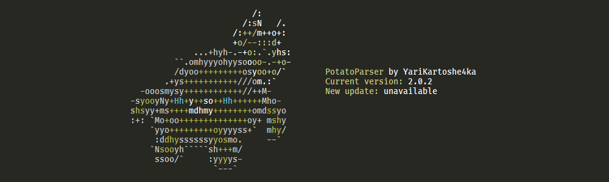

<div align="center">

  ## PotatoParser

  Converter of Ducky Script to Arduino sketch with some additional funcitons (like Alt codes)

   [](https://yarikartoshe4ka.github.io/PotatoParser) 

  
</div>


# Quickstart

This quickstart will show you all process of conversion Ducky Script to Arduino sketch


### Requirements

To reproduce what is described here, you need to satisfy the following dependencies

- [Python](https://www.python.org/downloads/)
- [Arduino IDE](https://www.arduino.cc/en/software)
- [Sublime Text](https://www.sublimetext.com/download)

download and install them to continue


### Installation

Now you can install [PotatoParser](https://pypi.org/project/pparser/) from PyPI packages using pip

```bash
pip install pparser
```

or the latest (but possibly unstable) from GitHub

```bash
pip install git+https://github.com/YariKartoshe4ka/PotatoParser.git
```


### Processing

Let's write a test ducky script like this

```
REM Opens notepad and writing "Hello World!" 5 times
WINDOWS r
DELAY 200
STRING notepad.exe
ENTER
DELAY 500
STRING Hello World!
ENTER
REPEAT 4 2
```

And save it as *test.ducky* file. Now you can convert this script to valid Arduino sketch with the following command

```bash
pparser test.ducky
```

In current directory you can discover new folder *sketch* which contains Arduino sketch


### Flashing

Open prepared sketch in Arduino IDE. Connect your board to PC and flash it. **Make sure you have enabled NumLock on your keyboard.** Upon completion, the script will start executing and, if you did everything correctly, you will see "Hello World!" printed 10 times in notepad. Here you can see the result (note that despite the **current Russian layout** ("РУС" = Russian), the **text was printed in English**):

https://user-images.githubusercontent.com/49284924/148426223-d6935708-9a0b-4523-ad12-71c63402a12f.mp4
